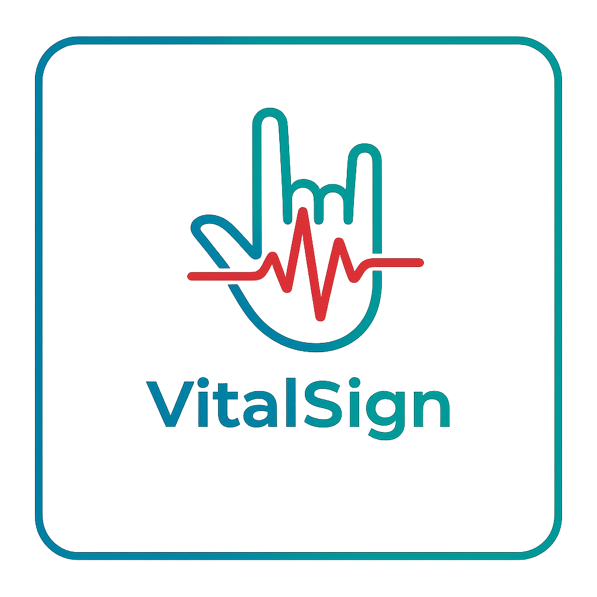

<div align="center">
  
</div>

<h1 align = "center">
    VitalSign
</h1>

<div align = "center"> Express more than words. An accessibility tool that helps Deaf and non-verbal users communicate naturally by translating sign language and emotional context into clear, expressive speech. </div>

<br>

## 💡 Inspiration
For Deaf and non-verbal individuals, digital communication often strips away the nuance of human connection. Standard text-to-speech tools are "robotic" and lose the urgency, joy, or hesitation behind the words.

We didn't want to build just another translator. We wanted to build a communication co-pilot—one that understands not just what you are saying, but how you are feeling, restoring the emotional bridge that is often lost in translation.

<br>

## 🚀 What It Does
**VitalSign** is a web-based accessibility dashboard that:

* Observes hand gestures in real-time using your webcam.

* Detects emotional context (facial expressions) alongside the signs.

* Refines disjointed sign glosses (e.g., "I doctor scared pain chest") into fluent, natural English ("I'm scared—my chest hurts and I need a doctor") using Google Gemini.

* Speaks the message using ElevenLabs, dynamically adjusting the voice's stability and tone to match the user's detected emotion (e.g., calm vs. urgent).

<br>

## ⚙️ How We Built It
We built VitalSign as a responsive Next.js application to ensure it works on any device with a browser and camera.

1. The Eye (Computer Vision) 👁️
* MediaPipe Tasks Vision: We implemented HandLandmarker to track 21 distinct hand points directly in the browser.
* Gesture Logic: We built a custom geometric analyzer in HandTracker.jsx to map finger states and motion vectors to specific ASL phrases (e.g., distinguishing "Help" vs. "Hello" based on palm orientation and movement).

2. The Brain (Generative AI) 🧠
Google Gemini 2.0 Flash: We use Gemini not just for grammar, but for intent classification. It takes the raw stream of glosses and the "Physical Intensity" score from the vision engine to rewrite the sentence with the correct emotional weight.

3. The Voice (Expressive TTS) 🔊
ElevenLabs API: Instead of a flat voice, we dynamically stream audio buffers. If Gemini flags the sentiment as "Urgent" or "Happy," we modulate the stability and style parameters of the ElevenLabs engine to produce a voice that sounds genuinely human.

4. The Frontend (UI/UX) 💻
* React + Next.js: Built for low-latency performance.
* Broadcast Mode: Designed for integration with OBS Studio, allowing users to pipe their translated subtitles directly into Zoom, Slack, or Google Meet calls.


<br>

## 🛠️ Installation & Usage
Prerequisites
* Node.js 18+
* A webcam
* API Keys for Google Gemini and ElevenLabs

<br> 

## Steps
1. Clone the repo
```
git clone https://github.com/liamma06/vitalsign.git
cd vitalsign
```

2. Install dependencies
```
npm install
```

3. Set up environment variables Create a .env.local file in the root directory:
```
GEMINI_API_KEY=your_gemini_key_here
ELEVENLABS_API_KEY=your_elevenlabs_key_here
ELEVENLABS_VOICE_ID=your_preferred_voice_id
```

4. Run the development server
```
npm run dev
```
5. Open in Browser Navigate to `http://localhost:3000` to see the dashboard.
6. Broadcast Mode (For Zoom/Meet) Navigate to `http://localhost:3000/broadcast` and use OBS Studio to capture the window as a Virtual Camera.

<br>

## 🧠 What We Learned
Latency Matters: Balancing the heavy lifting of MediaPipe (client-side) with the intelligence of Gemini (server-side) required careful optimization to keep the "conversation" feeling real-time.

Geometric Math is Hard: Distinguishing between similar signs (like "Yes" vs. "No") purely using vector math was a fun challenge in 3D spatial reasoning.

Emotion is Data: We learned that "accessibility" isn't just about utility; it's about dignity. Giving a user a voice that sounds like them (happy, sad, urgent) is just as important as the words themselves.

<br>

## 🔮 What's Next for VitalSign
Full ASL Vocabulary: Training a custom model to recognize thousands of signs beyond our MVP demo set.

Biometric Integration: Using smartwatches to detect heart rate and automatically trigger "Urgent" voice modes during high-stress situations.

Mobile App: Porting the logic to React Native for a truly portable pocket interpreter.

Built with 💜 for DeltaHacks.
